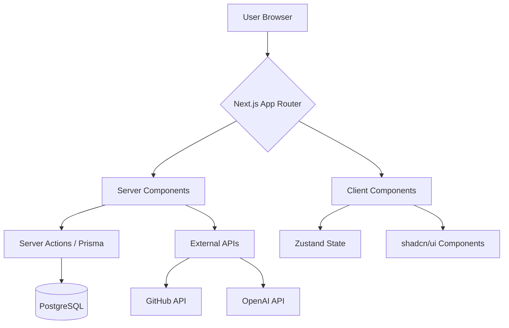

# 프로젝트 기획서: PortfolioForge

## 📋 목차

1. [프로젝트 개요](#1-프로젝트-개요)
2. [문제 정의](#2-문제-정의)
3. [솔루션](#3-솔루션)
4. [타겟 사용자](#4-타겟-사용자)
5. [핵심 기능](#5-핵심-기능)
6. [기술 아키텍처](#6-기술-아키텍처)
7. [개발 로드맵](#7-개발-로드맵)
8. [차별화 전략](#8-차별화-전략)
9. [포트폴리오 전략](#9-포트폴리오-전략)
10. [KPI 및 성공 지표](#10-kpi-및-성공-지표)
11. [인터페이스 및 라우팅 설계](#11-인터페이스-및-라우팅-설계)

---

## 1. 프로젝트 개요

### 1.1 프로젝트 명

**PortfolioForge** - 개발자 맞춤형 동적 포트폴리오 빌더

### 1.2 비전

> "개발자가 코드에 집중하는 동안, 포트폴리오는 저희가 관리합니다"

### 1.3 한 줄 설명

GitHub, 블로그, 알고리즘 플랫폼 등 다양한 데이터 소스를 자동 수집하여 AI 기반 추천과 실시간 편집이 가능한 맞춤형 포트폴리오 생성 플랫폼

### 1.4 개발 기간

총 14주 (MVP 6주 + 확장 4주 + 고도화 4주)

---

## 2. 문제 정의

### 2.1 개발자 포트폴리오 작성의 어려움

| 문제점      | 설명                                       | 데이터          |
| ----------- | ------------------------------------------ | --------------- |
| 시간 소모   | 평균 8-15시간 소요                         | 설문조사 기반   |
| 디자인 부담 | 68% 개발자가 디자인으로 인한 업데이트 미룸 | GitHub 설문     |
| 정적 콘텐츠 | 실시간 성과 반영 불가                      | 사용자 인터뷰   |
| 관리 불편   | 여러 플랫폼 데이터 통합 어려움             | 커뮤니티 피드백 |

### 2.2 기존 솔루션의 한계

- **정적 템플릿**: 개인화 부족, 업데이트 수동
- **GitHub Pages**: 디자인 제한적, 설정 복잡
- **Notion**: SEO 취약, 개발자 특화 기능 부재
- **유료 템플릿**: 비용 대비 유연성 낮음

---

## 3. 솔루션

### 3.1 핵심 가치 제안

```
✅ 데이터 자동화: GitHub 연동으로 프로젝트 자동 수집
✅ 스마트 큐레이션: AI 기반 최적의 프로젝트 배열 제안
✅ 실시간 편집: WYSIWYG 에디터 + 코드 기반 커스터마이징
✅ 원클릭 배포: Vercel/Netlify 연동으로 간편 배포
```

### 3.2 비즈니스 모델 (참고)

```yaml
Free Tier:
  - 1개 포트폴리오
  - 기본 템플릿 3종
  - GitHub 기본 연동

Pro Tier ($8/월):
  - 무제한 포트폴리오
  - 커스텀 도메인
  - 고급 분석 도구
  - AI 추천 기능

Team Tier ($25/월):
  - 팀 협업 기능
  - 프라이빗 템플릿
  - 우선 지원
```

---

## 4. 타겟 사용자

### 4.1 주요 페르소나

#### 페르소나 A: 이직 준비 개발자

- **이름**: 김개발 (28세)
- **직무**: 2년차 프론트엔드 개발자
- **목표**: 3개월 내 이직 성공
- **페인 포인트**:
  - GitHub 프로젝트 정리 어려움
  - 디자인 능력 부족
  - 기술 스택 효과적 표현 미흡

#### 페르소나 B: 취업 준비생

- **상태**: 부트캠프 수료 1개월 차
- **목표**: 첫 개발자 취업
- **필요**:
  - 빠른 포트폴리오 제작
  - 채용 담당자 눈길 끌기
  - 프로젝트 스토리텔링

---

## 5. 핵심 기능

### 5.1 데이터 자동 수집 모듈

```typescript
// 데이터 소스 연동 구조
interface DataSources {
  github: {
    repositories: Repository[];
    contributions: ContributionGraph;
    skills: string[];
  };
  blog?: {
    posts: BlogPost[];
    rssFeed: string;
  };
  algorithm?: {
    solvedProblems: number;
    platforms: string[];
  };
  custom?: Project[];
}
```

### 5.2 AI 기반 프로젝트 큐레이션

```
🎯 기술 스택 분석
  - package.json, README 기반 기술 태깅
  - 프로젝트별 기술 가중치 계산

🎯 스토리텔링 추천
  - 프로젝트 간 연관성 발견
  - 커리어 성장 스토리 라인 제안

🎯 최적화 배열
  - 채용 담당자 선호도 데이터 기반
  - 모바일/데스크탑 최적 레이아웃
```

### 5.3 실시간 WYSIWYG 에디터

```jsx
// 블록 기반 컴포넌트 구조
<PortfolioEditor>
  <HeaderBlock editable />
  <ProjectGrid
    projects={curatedProjects}
    layout="grid" // grid, list, masonry
  />
  <SkillsChart data={skillsData} interactive />
  <ContactForm integrations={["email", "linkedin"]} />
</PortfolioEditor>
```

### 5.4 디자인 시스템

```
🎨 3단계 커스터마이징 레벨:

Level 1: 테마 선택기 (6개 프리셋)
  - Minimalist, Creative, Corporate 등

Level 2: 디자인 토큰 편집기
  - 색상 팔레트
  - 타이포그래피 시스템
  - 간격(Spacing) 스케일

Level 3: 고급 CSS 편집
  - CSS-in-JS 지원
  - 컴포넌트별 스타일 오버라이드
```

### 5.5 접근성 및 SEO

```
✅ WCAG 2.1 기준 자동 검사
  - 색상 대비도 검증
  - 키보드 네비게이션 검사
  - 스크린 리더 호환성

✅ SEO 최적화 자동화
  - 메타 태그 자동 생성
  - 사이트맵 생성
  - Open Graph 이미지 생성
```

### 5.6 배포 및 분석

```
🚀 원클릭 배포
  - Vercel, Netlify, GitHub Pages 연동
  - 커스텀 도메인 설정
  - SSL 자동 적용

📊 분석 대시보드
  - 방문자 추적 (간단한 GA 대체)
  - 프로젝트 클릭률 분석
  - 연락처 전환율 추적
```

---

제시해주신 기획서의 **6. 기술 아키텍처** 섹션을 사용자의 요구사항(Next.js App Router 통합 구현, Tailwind CSS, shadcn/ui)에 맞춰 최적화하여 업데이트해 드립니다.

Full-stack 프레임워크로서의 Next.js 강점을 살리고, 생산성을 극대화할 수 있는 최신 라이브러리 조합으로 재구성했습니다.

---

## 6. 기술 아키텍처 (Updated)

### 6.1 기술 스택 (Full-stack Next.js)

**Core Framework & Language**

- **Framework**: **Next.js 14+ (App Router)** - 프론트엔드와 백엔드 API를 단일 코드베이스에서 관리
- **Language**: **TypeScript** - 데이터 모델 및 API 응답의 타입 안정성 확보
- **Runtime**: Node.js 18+

**Frontend (UI/UX)**

- **Styling**: **Tailwind CSS** - 유틸리티 퍼스트 기반의 빠른 스타일링
- **Component Library**: **shadcn/ui** - Radix UI 기반의 고품질, 접근성 준수 컴포넌트 활용
- **State Management**:
- **Server State**: TanStack Query (React Query) - 서버 데이터 캐싱 및 동기화
- **Client State**: Zustand - 에디터 설정 및 UI 상태 관리

- **Icons**: Lucide React

**Backend & Data**

- **API**: Next.js **Route Handlers** (Serverless Functions)
- **Database**: **PostgreSQL** (with Neon or Supabase)
- **ORM**: **Prisma** 또는 **Drizzle ORM** - Type-safe한 DB 쿼리 및 마이그레이션 관리
- **Authentication**: **NextAuth.js** (Auth.js) - GitHub OAuth 연동 및 세션 관리
- **Validation**: **Zod** - API 요청 및 환경 변수 스키마 검증

**Infrastructure & Tools**

- **Deployment**: **Vercel** - Next.js 최적화 배포 및 Edge Functions 활용
- **Storage**: **AWS S3** 또는 **Uploadthing** - 사용자 업로드 이미지 및 자산 저장
- **AI Integration**: **OpenAI API** - 프로젝트 요약 및 스토리텔링 큐레이션 생성

### 6.2 데이터 흐름 설계 (Next.js 특화)

Next.js의 Server Components와 Client Components를 전략적으로 분리하여 성능을 최적화합니다.



### 6.3 주요 기술적 의사결정

1. **Why shadcn/ui?**

- 직접 코드를 소유할 수 있어 커스터마이징이 자유롭습니다 (포트폴리오 빌더의 테마 시스템 구현에 필수적).
- Tailwind CSS와 완벽하게 조화되어 일관된 디자인 시스템 구축이 빠릅니다.

2. **Why Server Actions?**

- 별도의 API 엔드포인트를 정의하지 않고도 폼 제출, 데이터 업데이트를 안전하게 처리하여 개발 복잡도를 낮춥니다.

3. **Why Prisma/Drizzle?**

- TypeScript와의 시너지가 극대화되어, DB 스키마 변경 시 프론트엔드까지 즉각적인 타입 체크가 가능합니다.

---

## 7. 개발 로드맵

### Phase 1: MVP 개발 (6주)

| 주차 | 주제           | 주요 태스크                                                          |
| ---- | -------------- | -------------------------------------------------------------------- |
| 1-2  | 기반 아키텍처  | - 프로젝트 초기화<br>- GitHub OAuth 연동<br>- 기본 데이터 모델 설계  |
| 3-4  | 코어 에디터    | - 드래그앤드롭 블록 시스템<br>- 실시간 미리보기<br>- 기본 템플릿 3종 |
| 5-6  | 배포 및 폴리싱 | - 정적 사이트 생성<br>- Vercel 연동<br>- 기본 문서화                 |

### Phase 2: 확장 기능 (4주)

- AI 기반 프로젝트 추천 시스템
- 고급 디자인 커스터마이징
- 분석 대시보드 구현
- 커뮤니티 템플릿 마켓플레이스

### Phase 3: 고도화 (4주)

- 팀 포트폴리오 기능
- CV/이력서 생성기 연동
- 채용 담당자 뷰 모드
- 프리미엄 기능 개발

---

## 8. 차별화 전략

### 8.1 경쟁사 비교

| 기능          | PortfolioForge | GitHub Pages | Notion  | 유료 템플릿 |
| ------------- | -------------- | ------------ | ------- | ----------- |
| 데이터 자동화 | ✅             | ❌           | ⚠️      | ❌          |
| 실시간 편집   | ✅             | ❌           | ✅      | ❌          |
| AI 큐레이션   | ✅             | ❌           | ❌      | ❌          |
| 접근성 검사   | ✅             | ❌           | ❌      | ⚠️          |
| 비용          | 무료~$8        | 무료         | 무료~$8 | $20~$100    |

### 8.2 고유 가치 제안

**Context-Aware 큐레이션**

- 프로젝트를 단순 나열이 아닌 스토리로 연결
- 기술적 성장 과정 시각화

**개발자 친화적 UX**

- CLI 도구 제공 (포트폴리오 CLI 관리자)
- VS Code 확장 프로그램 연동
- Git-like 버전 관리

**지속적 업데이트 시스템**

- GitHub 웹훅 기반 자동 싱크
- 월간 성과 리포트 자동 생성

---

## 9. 포트폴리오 전략

### 9.1 이 프로젝트로 증명할 역량

**✅ 기술적 깊이**

- 복잡한 상태 관리 (멀티 테넌시 환경)
- 실시간 협업 시스템 설계
- 성능 최적화 (가상화, 지연 로딩)
- TypeScript 고급 활용

**✅ 문제 해결 능력**

- GitHub API 레이트 리밋 핸들링
- 대용량 데이터 클라이언트 처리
- 크로스 브라우저 호환성 보장

**✅ 프로덕트 센스**

- 사용자 리서치 기반 기능 개발
- 데이터 기반 의사결정
- 접근성 우선 설계

### 9.2 포트폴리오 효과적 소개법

1. **라이브 데모 링크** 포함
   - 직접 만든 자신의 포트폴리오: portfolioforge.vercel.app
   - 관리자 데모 계정 제공

2. **기술 블로그 시리즈**
   - "실시간 편집기의 동시성 문제 해결기"
   - "GitHub 데이터 캐싱 전략: 90% 성능 향상"
   - "접근성 자동 검사 시스템 구축기"

3. **데이터 기반 인사이트**
   - "사용자 행동 분석으로 발견한 3가지 인사이트"
   - "A/B 테스트: 어떤 템플릿이 더 효과적일까?"

### 9.3 GitHub 저장소 구성

```
portfolio-forge/
├── README.md          # 프로젝트 개요, 실행 방법
├── CHANGELOG.md       # 개발 기록
├── docs/              # 상세 문서
│   ├── ARCHITECTURE.md
│   ├── API.md
│   └── DEPLOYMENT.md
├── src/
│   ├── core/          # 핵심 로직
│   ├── editor/        # 에디터 컴포넌트
│   ├── integrations/  # 외부 연동
│   └── utils/         # 유틸리티 함수
└── tests/             # 테스트 코드
```

---

## 10. KPI 및 성공 지표

### 10.1 제품 메트릭

```yaml
사용자 참여:
  - 평균 세션 시간: > 10분
  - 템플릿 사용률: > 70%
  - GitHub 연동률: > 85%
  - 포트폴리오 생성률: > 60%

기술적:
  - Lighthouse 성능 점수: > 90
  - 빌드 시간: < 30초
  - API 응답 시간: < 200ms
  - 에러 발생률: < 0.1%
```

### 10.2 비즈니스 메트릭 (참고)

- MAU (월간 활성 사용자): 1,000명 (3개월 목표)
- 전환율 (무료→유료): 5%
- NPS (순추천지수): > 40
- 채용 성공 사례 수: 50+ (사용자 인터뷰)

## 11. 인터페이스 및 라우팅 설계 (v2.0)

사용자 경험(UX)의 일관성과 기술적 최적화(SEO, 권한 관리)를 위해 서비스 영역을 **Public(마케팅)**, **Auth(인증)**, **App(관리/편집)**, **Output(배포)**의 4가지 레이어로 분리하여 설계합니다.

### 11.1 서비스 레이어 구조

1.  **Public Layer (`/`)**: 비로그인 사용자 대상. 서비스 가치 제안 및 SEO 최적화.
2.  **Auth Layer (`/auth`, `/onboarding`)**: 신규 유저 유입 및 데이터 초기 동기화.
3.  **App Layer (`/dashboard`, `/editor`, `/settings`)**: 로그인 유저 전용 작업 공간. 일관된 UI/UX 제공.
4.  **Output Layer (`/[domain]`)**: 최종 결과물. 초고속 로딩을 위한 ISR(Incremental Static Regeneration) 적용.

### 11.2 디렉토리 아키텍처 (Next.js App Router)

```text
app/
├── (marketing)/             # [Public] 루트 및 홍보 영역
│   ├── layout.tsx           # 랜딩 전용 헤더/푸터 (로그인 버튼 등)
│   ├── page.tsx             # 루트 경로 (/) - 서비스 메인 랜딩 페이지
│   └── pricing/             # 요금제 안내 페이지
├── (auth)/                  # [Auth] 인증 및 유저 온보딩
│   ├── login/               # 소셜 로그인 (GitHub OAuth)
│   └── onboarding/          # 최초 가입 시 데이터 수집 마법사
├── (dashboard)/             # [App] 대시보드 및 설정 (통합 LNB 레이아웃 공유)
│   ├── layout.tsx           # 사이드바 내비게이션 포함 공통 레이아웃
│   ├── dashboard/           # 내 포트폴리오 목록 및 요약 통계
│   ├── projects/            # GitHub 데이터 관리 및 AI 큐레이션 풀
│   ├── analytics/[id]/      # 개별 포트폴리오 상세 분석
│   └── settings/            # 서비스 전역 설정 (일관된 구조)
│       ├── page.tsx         # 기본 경로: 프로필 및 계정 설정
│       ├── integrations/    # 플랫폼 연동 (GitHub, 블로그, 알고리즘)
│       └── billing/         # 구독 및 결제 내역 관리
├── editor/[id]/             # [Tool] 실시간 편집 영역
│   ├── layout.tsx           # 에디터 전용 전체화면 레이아웃
│   └── page.tsx             # WYSIWYG 캔버스 및 속성 패널
└── [domain]/                # [Output] 배포된 사용자 포트폴리오
    └── page.tsx             # 사용자 커스텀 도메인 기반 동적 라우팅
```

### 11.3 주요 페이지 인터페이스 명세

| 페이지 분류   | URL 경로 | 핵심 컴포넌트 및 기능      | 비고 |
| ------------- | -------- | -------------------------- | ---- |
| **메인 랜딩** | `/`      | • Hero 섹션 (CTA 버튼)<br> |

<br>• 기능 소개 및 템플릿 쇼케이스<br>

<br>• 기술 블로그 연동 예시 시각화 | SEO 최적화 |
| **대시보드** | `/dashboard` | • 생성된 포트폴리오 카드 그리드<br>

<br>• 전체 방문자 수 현황 대시보드<br>

<br>• '새로운 프로젝트 Forge' 버튼 | 앱 홈 |
| **데이터 관리** | `/projects` | • GitHub 레포지토리 동기화 리스트<br>

<br>• 기술 스택 자동 태깅 및 수정 기능<br>

<br>• AI 기반 프로젝트 요약 생성기 | 기획 5.1 반영 |
| **실시간 에디터** | `/editor/[id]` | • 드래그앤드롭 컴포넌트 배치<br>

<br>• 디자인 토큰(색상, 폰트) 실시간 적용<br>

<br>• SEO 설정 및 원클릭 배포 버튼 | 기획 5.3 반영 |
| **통합 설정** | `/settings` | • **프로필**: 닉네임, 이메일, 아바타 관리<br>

<br>• **연동**: GitHub 토큰 및 RSS 피드 관리<br>

<br>• **결제**: 플랜 업그레이드 및 구독 관리 | **일관성 강화** |

### 11.4 설계 원칙 및 UI 일관성

- **컴포넌트 재사용**: `/dashboard`와 `/settings`는 동일한 사이드바 레이아웃(`app/(dashboard)/layout.tsx`)을 공유하여 사용자에게 심리적 안정감을 제공합니다.
- **반응형 전략**: 모든 관리 페이지는 모바일에서 탭(Tab) 메뉴로 전환되는 반응형 내비게이션을 지원합니다.
- **상태 동기화**: `settings/integrations`에서 변경된 데이터 소스는 즉시 `projects` 페이지와 `editor`에 반영되도록 Zustand 스토어를 연동합니다.
