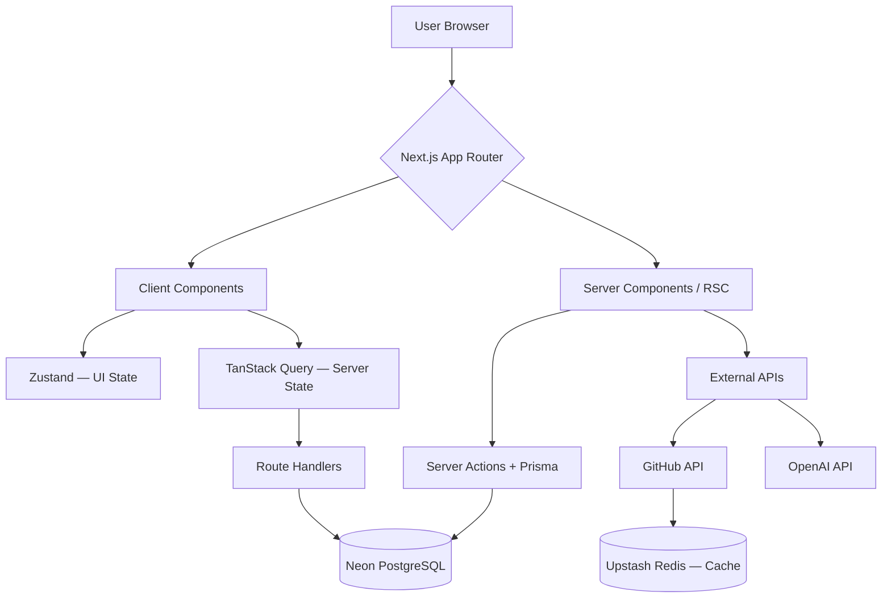

# PortfolioForge — 기술 스택 및 아키텍처 레퍼런스 (GEMINI.md)

> AI 코딩 어시스턴트 및 개발자가 프로젝트 컨텍스트를 파악하기 위한 기술 문서입니다.  
> 기획 의도·페르소나·KPI는 [PLANNING.md](./PLANNING.md)를 참조하세요.

---

## 📋 목차

1. [기술 스택 전체 요약](#1-기술-스택-전체-요약)
2. [기술 의사결정 근거](#2-기술-의사결정-근거)
3. [인프라 아키텍처](#3-인프라-아키텍처)
4. [DB 스키마](#4-db-스키마)
5. [API 명세](#5-api-명세)
6. [디렉토리 구조 및 라우팅](#6-디렉토리-구조-및-라우팅)
7. [기술 리스크 및 대응 전략](#7-기술-리스크-및-대응-전략)
8. [월간 운영 비용 추정](#8-월간-운영-비용-추정)

---

## 1. 기술 스택 전체 요약

| 영역              | 기술                         | 버전   | 선택 이유                                                   |
| ----------------- | ---------------------------- | ------ | ----------------------------------------------------------- |
| **Core**          | Next.js (App Router)         | 14+    | 프론트/백 단일 코드베이스, RSC·SSR·ISR 모두 활용            |
|                   | TypeScript                   | 5+     | 데이터 모델·API 응답 타입 안정성 확보                       |
|                   | Node.js                      | 18+    | Runtime                                                     |
| **UI**            | Tailwind CSS                 | 3+     | 유틸리티 퍼스트, 디자인 토큰 시스템과 자연스러운 통합       |
|                   | shadcn/ui                    | latest | 컴포넌트 소유권 확보 → 테마 시스템 구현 필수                |
|                   | Lucide React                 | latest | 아이콘                                                      |
| **상태 관리**     | TanStack Query               | 5+     | 서버 상태 캐싱·동기화                                       |
|                   | Zustand                      | 4+     | 에디터 UI 상태, 클라이언트 전역 상태                        |
| **에디터**        | dnd-kit                      | latest | 드래그앤드롭 블록 시스템, 가벼운 번들 크기                  |
| **DB**            | PostgreSQL (Neon Serverless) | -      | Connection Pooling 자동 관리, Vercel 환경 최적화            |
| **ORM**           | Prisma                       | 5+     | TypeScript 타입 안정성, 스키마 변경 시 즉각 타입 체크       |
| **인증**          | NextAuth.js (Auth.js)        | v5     | GitHub OAuth 네이티브 지원, JWT/세션 전략 선택              |
| **캐시**          | Upstash Redis                | -      | GitHub API Rate Limit 대응, TTL 캐싱 + Rate Limiter         |
| **검증**          | Zod                          | 3+     | API 요청·환경변수 런타임 검증, discriminatedUnion 블록 검증 |
| **스토리지**      | Cloudflare R2                | -      | S3 호환 API, Egress 비용 무료                               |
| **AI**            | OpenAI API (GPT-4o-mini)     | -      | GPT-4o 대비 1/10 비용, README 요약·태깅 품질 충분           |
| **배포**          | Vercel                       | -      | Next.js 최적화, Edge Middleware, ISR 네이티브 지원          |
| **에러 모니터링** | Sentry                       | -      | 무료 티어로 에러율 0.1% 미만 목표 관리                      |

---

## 2. 기술 의사결정 근거

### Why shadcn/ui?

컴포넌트 코드를 직접 소유해 포트폴리오 테마 시스템 구현에 필수적입니다.  
Tailwind CSS와 완벽 통합되어 디자인 토큰 적용이 자연스럽고, 특정 버전에 종속되지 않습니다.

### Why Server Actions?

별도 API 엔드포인트 없이 폼 제출·데이터 업데이트 처리가 가능합니다.  
보일러플레이트 감소, CSRF 자동 방어, 타입 안전한 서버-클라이언트 통신을 제공합니다.

### Why Neon + Upstash?

둘 다 Serverless 특화입니다. Vercel의 Cold Start 환경에서 Connection Pooling 문제가 없으며, 모두 무료 티어로 시작 가능합니다.

### Why GPT-4o-mini?

GPT-4o 대비 1/10 비용으로 README 요약·기술 태깅 품질이 충분합니다.  
결과를 DB에 캐싱해 동일 레포 재분석 시 API 호출을 완전히 제거합니다.

### Why Cloudflare R2?

S3 호환 API로 마이그레이션 없이 전환 가능합니다. Egress 비용이 무료라 이미지 서빙 비용이 AWS S3 대비 대폭 절감됩니다.

### Why Prisma over Drizzle?

TypeScript 에코시스템 성숙도와 팀 협업 시 스키마 가독성을 우선합니다.  
성능이 중요해지는 시점에 Drizzle 마이그레이션을 검토합니다.

---

## 3. 인프라 아키텍처

```
┌─────────────────────────────────────────────────────┐
│                    USERS                            │
│            Browser / Mobile                         │
└──────────────────┬──────────────────────────────────┘
                   │ HTTPS
┌──────────────────▼──────────────────────────────────┐
│              VERCEL EDGE NETWORK                    │
│                                                     │
│  ┌──────────────────────────────────────────────┐  │
│  │          Next.js 14 (App Router)             │  │
│  │                                              │  │
│  │  Server Components  │  Route Handlers        │  │
│  │  (RSC / ISR / SSR)  │  (REST API)            │  │
│  │                     │                        │  │
│  │  Edge Middleware ───┼── Auth 검증 (JWT)      │  │
│  └──────────┬──────────┴──────────┬─────────────┘  │
└─────────────┼─────────────────────┼────────────────┘
              │                     │
   ┌──────────▼──────┐   ┌──────────▼──────────┐
   │  Neon PostgreSQL │   │   Upstash Redis     │
   │  (Serverless)   │   │                     │
   │                 │   │  - TTL 1h 캐싱      │
   │  - Auto Pooling │   │  - Rate Limiter     │
   └──────────────────┘   └─────────────────────┘

   External Services
   ─────────────────
   GitHub API ──── Webhook ──► /api/webhooks/github
   OpenAI API (GPT-4o-mini)
   Cloudflare R2 (이미지·에셋, S3 호환)
   Stripe (결제, Phase 2)
```

### 데이터 흐름



---

## 4. DB 스키마

### 4.1 엔티티 관계 요약

| 테이블             | 핵심 컬럼                   | 설명                                                                    |
| ------------------ | --------------------------- | ----------------------------------------------------------------------- |
| `users`            | `plan`, `ai_credits`        | NextAuth 연동. `plan(free/pro/team)`, `ai_credits`로 크레딧 관리        |
| `integrations`     | `provider`, `access_token`  | GitHub·블로그 연동. `access_token`은 AES-256 암호화 저장 필수           |
| `raw_projects`     | `ai_score`, `ai_summary`    | GitHub 레포 원본 + AI 분석 결과. `UNIQUE(user_id, source, external_id)` |
| `portfolios`       | `slug`, `design_tokens`     | 사용자당 복수 생성. `design_tokens`는 JSONB(색상·폰트·spacing)          |
| `portfolio_blocks` | `block_type`, `config`      | 에디터 블록. `config`는 `block_type`별 Zod discriminatedUnion으로 검증  |
| `analytics_events` | `event_type`, `session_id`  | 경량 자체 애널리틱스. 월별 파티셔닝 권장                                |
| `feed_items`       | `item_type`, `published_at` | RSS·블로그·알고리즘 피드 수집 결과 저장                                 |

### 4.2 전체 스키마 (PostgreSQL)

```sql
-- 1. 사용자 계정 (NextAuth 연동)
CREATE TABLE users (
  id              UUID PRIMARY KEY DEFAULT gen_random_uuid(),
  email           VARCHAR(255) UNIQUE NOT NULL,
  name            VARCHAR(100),
  avatar_url      TEXT,
  github_login    VARCHAR(100) UNIQUE,
  github_id       BIGINT UNIQUE,
  plan            VARCHAR(20) DEFAULT 'free', -- free | pro | team
  plan_expires_at TIMESTAMPTZ,
  ai_credits      INTEGER DEFAULT 3,          -- Free: 월 3회, 월초 리셋
  created_at      TIMESTAMPTZ DEFAULT NOW(),
  updated_at      TIMESTAMPTZ DEFAULT NOW()
);

-- 2. 연동된 데이터 소스
CREATE TABLE integrations (
  id            UUID PRIMARY KEY DEFAULT gen_random_uuid(),
  user_id       UUID REFERENCES users(id) ON DELETE CASCADE,
  provider      VARCHAR(50) NOT NULL,       -- github | tistory | velog | baekjoon
  access_token  TEXT,                       -- AES-256 암호화 저장 필수
  refresh_token TEXT,
  metadata      JSONB,                      -- provider별 추가 정보
  synced_at     TIMESTAMPTZ,
  is_active     BOOLEAN DEFAULT TRUE,
  UNIQUE(user_id, provider)
);

-- 3. 수집된 원본 프로젝트 데이터
CREATE TABLE raw_projects (
  id               UUID PRIMARY KEY DEFAULT gen_random_uuid(),
  user_id          UUID REFERENCES users(id) ON DELETE CASCADE,
  source           VARCHAR(50) NOT NULL,    -- github | manual
  external_id      VARCHAR(255),           -- GitHub repo id 등
  name             VARCHAR(255) NOT NULL,
  description      TEXT,
  html_url         TEXT,
  language         VARCHAR(100),
  topics           TEXT[],
  stargazers_count INTEGER DEFAULT 0,
  forks_count      INTEGER DEFAULT 0,
  is_fork          BOOLEAN DEFAULT FALSE,
  pushed_at        TIMESTAMPTZ,
  raw_data         JSONB,                  -- API 원본 응답 보관
  ai_summary       TEXT,                   -- AI 생성 요약 (캐싱)
  ai_tags          TEXT[],                 -- AI 추출 기술 태그
  ai_score         FLOAT,                  -- 큐레이션 우선순위 점수 (0~1)
  is_featured      BOOLEAN DEFAULT FALSE,
  created_at       TIMESTAMPTZ DEFAULT NOW(),
  updated_at       TIMESTAMPTZ DEFAULT NOW(),
  UNIQUE(user_id, source, external_id)
);

-- 4. 포트폴리오 (복수 생성 가능)
CREATE TABLE portfolios (
  id              UUID PRIMARY KEY DEFAULT gen_random_uuid(),
  user_id         UUID REFERENCES users(id) ON DELETE CASCADE,
  slug            VARCHAR(100) NOT NULL,   -- URL 식별자
  title           VARCHAR(255),
  theme           VARCHAR(50) DEFAULT 'minimalist',
  design_tokens   JSONB,                   -- 색상·폰트·spacing 커스텀 값
  custom_domain   TEXT,                    -- Pro 전용 (Phase 2)
  is_published    BOOLEAN DEFAULT FALSE,
  seo_title       VARCHAR(255),
  seo_description TEXT,
  og_image_url    TEXT,
  view_count      INTEGER DEFAULT 0,
  published_at    TIMESTAMPTZ,
  created_at      TIMESTAMPTZ DEFAULT NOW(),
  updated_at      TIMESTAMPTZ DEFAULT NOW(),
  UNIQUE(user_id, slug)
);

-- 5. 포트폴리오 블록 (에디터 핵심)
CREATE TABLE portfolio_blocks (
  id           UUID PRIMARY KEY DEFAULT gen_random_uuid(),
  portfolio_id UUID REFERENCES portfolios(id) ON DELETE CASCADE,
  block_type   VARCHAR(50) NOT NULL,  -- hero | project_grid | skills | blog_feed | contact | custom_text
  position     INTEGER NOT NULL,
  config       JSONB NOT NULL,        -- block_type별 설정값 (Zod로 검증)
  is_visible   BOOLEAN DEFAULT TRUE,
  created_at   TIMESTAMPTZ DEFAULT NOW(),
  updated_at   TIMESTAMPTZ DEFAULT NOW()
);

/*
  config 예시 — project_grid:
  {
    "layout": "grid",
    "columns": 2,
    "project_ids": ["uuid1", "uuid2"],
    "show_tech_stack": true
  }

  config 예시 — skills:
  {
    "chart_type": "radar",
    "skills": [
      { "name": "TypeScript", "level": 90 },
      { "name": "Spring Boot", "level": 85 }
    ]
  }
*/

-- 6. 방문자 분석 이벤트 (경량 자체 애널리틱스)
CREATE TABLE analytics_events (
  id           BIGSERIAL PRIMARY KEY,
  portfolio_id UUID REFERENCES portfolios(id) ON DELETE CASCADE,
  event_type   VARCHAR(50) NOT NULL,  -- page_view | block_click | contact_click
  block_id     UUID,
  session_id   VARCHAR(100),
  referrer     TEXT,
  user_agent   TEXT,
  country_code VARCHAR(10),
  created_at   TIMESTAMPTZ DEFAULT NOW()
);

CREATE INDEX idx_analytics_portfolio_date
  ON analytics_events(portfolio_id, created_at DESC);

-- 7. 외부 콘텐츠 피드 (블로그·알고리즘)
CREATE TABLE feed_items (
  id             UUID PRIMARY KEY DEFAULT gen_random_uuid(),
  user_id        UUID REFERENCES users(id) ON DELETE CASCADE,
  integration_id UUID REFERENCES integrations(id) ON DELETE CASCADE,
  item_type      VARCHAR(50),  -- blog_post | solved_problem
  title          VARCHAR(500),
  url            TEXT,
  published_at   TIMESTAMPTZ,
  metadata       JSONB,
  created_at     TIMESTAMPTZ DEFAULT NOW()
);
```

### 4.3 Zod 블록 검증 스키마

```typescript
// src/schemas/portfolio.ts

export const DesignTokenSchema = z.object({
  primaryColor: z.string().regex(/^#[0-9A-F]{6}$/i),
  fontFamily: z.enum(["inter", "pretendard", "fira-code", "playfair"]),
  borderRadius: z.enum(["none", "sm", "md", "lg", "full"]),
  spacing: z.enum(["compact", "normal", "relaxed"]),
});

export const BlockConfigSchema = z.discriminatedUnion("block_type", [
  z.object({
    block_type: z.literal("hero"),
    config: z.object({
      headline: z.string().max(100),
      subheadline: z.string().max(200).optional(),
      show_github_stats: z.boolean().default(false),
    }),
  }),
  z.object({
    block_type: z.literal("project_grid"),
    config: z.object({
      layout: z.enum(["grid", "list", "masonry"]),
      columns: z.number().min(1).max(3),
      project_ids: z.array(z.string().uuid()).max(10),
      show_tech_stack: z.boolean(),
    }),
  }),
  z.object({
    block_type: z.literal("skills"),
    config: z.object({
      chart_type: z.enum(["radar", "bar", "tag_cloud"]),
      skills: z
        .array(
          z.object({
            name: z.string(),
            level: z.number().min(0).max(100),
          }),
        )
        .max(20),
    }),
  }),
  z.object({
    block_type: z.literal("blog_feed"),
    config: z.object({
      integration_provider: z.enum([
        "tistory",
        "velog",
        "medium",
        "custom_rss",
      ]),
      max_items: z.number().min(1).max(6),
      show_thumbnail: z.boolean(),
    }),
  }),
]);

export type DesignTokens = z.infer<typeof DesignTokenSchema>;
export type BlockConfig = z.infer<typeof BlockConfigSchema>;
```

---

## 5. API 명세

모든 인증 필요 엔드포인트는 `Authorization: Bearer <session_token>` 헤더를 요구합니다.

### 5.1 GitHub 연동 및 동기화

```
POST /api/integrations/github/sync
```

GitHub 레포지토리 전체 수집 및 AI 점수 계산 트리거. 비동기 처리.

| 항목         | 내용                                              |
| ------------ | ------------------------------------------------- |
| Auth         | Required                                          |
| Request      | `{ force?: boolean }` — `true` 시 Redis 캐시 무시 |
| Response 202 | `{ job_id: string, estimated_seconds: number }`   |

```
GET /api/integrations/github/sync/:job_id
```

동기화 진행 상태 폴링.

| Response | 내용                                                                                                       |
| -------- | ---------------------------------------------------------------------------------------------------------- |
| 200      | `{ status: 'pending' \| 'processing' \| 'completed' \| 'failed', progress: number, synced_count: number }` |

---

### 5.2 프로젝트 관리

```
GET /api/projects
```

| Query           | 설명                             |
| --------------- | -------------------------------- |
| `page`, `limit` | 페이지네이션 (default: 20)       |
| `sort`          | `ai_score \| pushed_at \| stars` |
| `filter`        | `featured \| all`                |

```
POST /api/projects/:id/curate
```

특정 프로젝트에 대해 AI 요약 및 태깅 실행.  
Free Tier: `ai_credits` 차감, 0이면 **402** 반환.

| Response 200 | `{ ai_summary, ai_tags, ai_score, credits_remaining }` |
| ------------ | ------------------------------------------------------ |

---

### 5.3 포트폴리오 CRUD

| Method   | Path                  | 설명                             |
| -------- | --------------------- | -------------------------------- |
| `GET`    | `/api/portfolios`     | 포트폴리오 목록                  |
| `POST`   | `/api/portfolios`     | 포트폴리오 생성                  |
| `PATCH`  | `/api/portfolios/:id` | 부분 업데이트 (에디터 자동 저장) |
| `DELETE` | `/api/portfolios/:id` | 삭제                             |

**에디터 자동저장 동작 방식**

- debounce 2초 후 `PATCH` 호출
- 서버의 `updatedAt` > 클라이언트의 `updatedAt`이면 **409 Conflict** 반환
- 클라이언트는 409 수신 시 사용자에게 덮어쓰기 여부 선택 UI 제공

---

### 5.4 블록 관리

| Method   | Path                                  | 설명                               |
| -------- | ------------------------------------- | ---------------------------------- |
| `GET`    | `/api/portfolios/:id/blocks`          | 블록 목록                          |
| `POST`   | `/api/portfolios/:id/blocks`          | 블록 추가                          |
| `PUT`    | `/api/portfolios/:id/blocks`          | 전체 순서 교체 (드래그앤드롭 저장) |
| `PATCH`  | `/api/portfolios/:id/blocks/:blockId` | 블록 설정 수정                     |
| `DELETE` | `/api/portfolios/:id/blocks/:blockId` | 블록 삭제                          |

```typescript
// PUT /api/portfolios/:id/blocks — 드래그앤드롭 후 순서 저장
Request: {
  blocks: Array<{ id: string; position: number }>;
}

// POST /api/portfolios/:id/blocks — 블록 추가
Request: {
  block_type: BlockType;
  position: number;
  config: BlockConfig; // Zod discriminatedUnion으로 검증
}
```

---

### 5.5 분석 API

```
POST /api/analytics/event
```

포트폴리오 방문자 이벤트 수집. **Auth 불필요** (공개 엔드포인트).

```typescript
Request: {
  portfolio_id: string;
  event_type:   'page_view' | 'block_click' | 'contact_click';
  block_id?:    string;
  session_id:   string; // 클라이언트 생성 UUID
}
```

```
GET /api/analytics/:portfolioId/summary?period=30d
```

본인 포트폴리오만 조회 가능. `period`: `7d | 30d | 90d`

```typescript
Response 200: {
  total_views:      number;
  unique_sessions:  number;
  top_referrers:    Array<{ source: string; count: number }>;
  block_engagement: Array<{
    block_id:         string;
    block_type:       string;
    click_count:      number;
  }>;
  daily_views: Array<{ date: string; count: number }>;
}
```

---

## 6. 디렉토리 구조 및 라우팅

### 6.1 서비스 레이어 구조

| 레이어     | 경로           | 렌더링 전략          | 목적                                 |
| ---------- | -------------- | -------------------- | ------------------------------------ |
| **Public** | `/(marketing)` | SSG + ISR            | 랜딩·프라이싱·SEO 최적화             |
| **Auth**   | `/(auth)`      | SSR                  | GitHub OAuth 로그인·신규 유저 온보딩 |
| **App**    | `/(dashboard)` | SSR + Client         | 포트폴리오 편집·관리 작업 공간       |
| **Output** | `/[slug]`      | ISR (60s revalidate) | 배포된 포트폴리오 공개 페이지        |

> ⚠️ **MVP 범위**: Output Layer는 서브도메인(`slug.portfolioforge.app`) 방식으로 운영.  
> 커스텀 도메인(Vercel Domains API)은 Phase 2 Pro 기능.

### 6.2 App Router 디렉토리 구조

```
app/
├── (marketing)/               # [Public] 비로그인 사용자 대상
│   ├── layout.tsx             # 랜딩 전용 헤더/푸터
│   ├── page.tsx               # 서비스 메인 랜딩 (/)
│   └── pricing/               # 요금제 안내
│
├── (auth)/                    # [Auth] 인증 및 온보딩
│   ├── login/                 # GitHub OAuth 소셜 로그인
│   └── onboarding/            # 최초 가입 데이터 수집 마법사
│
├── (dashboard)/               # [App] 로그인 유저 작업 공간
│   ├── layout.tsx             # 사이드바 내비게이션 공통 레이아웃
│   ├── dashboard/             # 포트폴리오 목록 + 요약 통계
│   ├── projects/              # GitHub 레포 관리 + AI 큐레이션 풀
│   ├── analytics/[id]/        # 개별 포트폴리오 상세 분석 (Pro)
│   └── settings/
│       ├── page.tsx           # 프로필·계정 설정 (기본 경로)
│       ├── integrations/      # GitHub 토큰·RSS 피드 연동 관리
│       └── billing/           # 구독 플랜·결제 내역
│
├── editor/[id]/               # [Tool] 실시간 편집 (전체화면)
│   ├── layout.tsx             # 에디터 전용 레이아웃 (사이드바 없음)
│   └── page.tsx               # WYSIWYG 캔버스 + 속성 패널
│
├── [slug]/                    # [Output] MVP: 서브도메인 방식
│   └── page.tsx               # slug 기반 ISR 포트폴리오 페이지
│
└── api/
    ├── auth/[...nextauth]/    # NextAuth 핸들러
    ├── integrations/          # GitHub 동기화, Webhook 수신
    ├── portfolios/            # CRUD + 블록 관리
    ├── projects/              # AI 큐레이션 트리거
    ├── analytics/             # 이벤트 수집 + 집계
    └── webhooks/github/       # Push 이벤트 증분 업데이트
```

### 6.3 주요 페이지 명세

| 페이지          | 경로              | 핵심 기능                                                  | 비고           |
| --------------- | ----------------- | ---------------------------------------------------------- | -------------- |
| 메인 랜딩       | `/`               | Hero CTA, 기능 소개, 템플릿 쇼케이스                       | SSG + SEO      |
| 대시보드        | `/dashboard`      | 포트폴리오 카드 그리드, 방문자 현황, 신규 생성 버튼        | 앱 홈          |
| 데이터 관리     | `/projects`       | GitHub 레포 동기화 리스트, AI 자동 태깅·수정, 요약 생성기  | 기능 5.1 반영  |
| 실시간 에디터   | `/editor/[id]`    | dnd-kit 블록 배치, 디자인 토큰 적용, SEO 설정, 원클릭 배포 | 전체화면       |
| 통합 설정       | `/settings`       | 프로필/계정, GitHub·RSS 연동, 플랜·결제 내역               | 공통 LNB 공유  |
| 분석 대시보드   | `/analytics/[id]` | 일별 방문자, 블록 클릭률, 레퍼러, 전환율                   | Pro 전용       |
| 포트폴리오 출력 | `/[slug]`         | ISR 렌더링, OG 이미지 자동 생성, 이벤트 수집               | 60s revalidate |

### 6.4 UI 일관성 원칙

- **컴포넌트 재사용**: `/dashboard`와 `/settings`는 동일 `(dashboard)/layout.tsx` 공유 → 심리적 일관성 제공
- **반응형 전략**: 관리 페이지 모바일 전환 시 사이드바 → 하단 탭 메뉴 (shadcn/ui `Sheet` 활용)
- **상태 동기화**: `settings/integrations` 변경 시 Zustand 즉시 업데이트 → `projects`·`editor`에 자동 반영
- **에디터 격리**: `/editor/[id]`는 별도 layout.tsx. 대시보드 사이드바 없음. 저장 상태·배포 버튼만 상단 노출

---

## 7. 기술 리스크 및 대응 전략

### 🔴 Critical — MVP 전 반드시 해결

#### ① GitHub API Rate Limit

| 항목       | 내용                                                                                                                               |
| ---------- | ---------------------------------------------------------------------------------------------------------------------------------- |
| **리스크** | OAuth 인증 시 시간당 5,000회 제한. 레포 100개 + 커밋 이력 수집 시 단일 사용자가 수십 회 소진. 온보딩 집중 시 서비스 전체 중단 가능 |
| **대응**   | 사용자 GitHub 토큰으로 요청 → Upstash Redis TTL 1시간 캐싱 → Webhook `push` 이벤트 시만 증분 업데이트                              |

#### ② AI 비용 폭증

| 항목       | 내용                                                                                                                                |
| ---------- | ----------------------------------------------------------------------------------------------------------------------------------- |
| **리스크** | GPT-4o-mini 레포 20개 요약 시 요청당 $0.02~0.05. Free Tier 사용자 1,000명 전수 실행 시 월 $20~50 발생. 무제한 허용 시 손익분기 붕괴 |
| **대응**   | Free Tier AI 크레딧 월 3회 제한. `ai_summary` DB 캐싱 → 재요청 시 OpenAI 호출 없이 반환                                             |

---

### 🟡 Important — MVP 이후 반드시 고려

#### ③ 커스텀 도메인 복잡도

| 항목       | 내용                                                                                                                       |
| ---------- | -------------------------------------------------------------------------------------------------------------------------- |
| **리스크** | Vercel Domains API로 수백 개 도메인을 동적 관리하려면 별도 서비스 레이어 필요. DNS 전파 지연·SSL 발급 시간 등 UX 문제 복합 |
| **대응**   | MVP는 서브도메인(`slug.portfolioforge.app`) 방식으로 출시. 커스텀 도메인은 Phase 2 Pro 기능으로 구현                       |

#### ④ 에디터 동시성 문제

| 항목       | 내용                                                                                                                |
| ---------- | ------------------------------------------------------------------------------------------------------------------- |
| **리스크** | 동일 포트폴리오를 두 탭에서 동시 편집 시 마지막 저장이 이전 변경사항 덮어씀                                         |
| **대응**   | 낙관적 업데이트 + `updatedAt` 충돌 감지(409) → 사용자에게 선택 UI 제공. Phase 3에서 Yjs/CRDT 실시간 협업으로 고도화 |

#### ⑤ ISR 캐시 무효화 타이밍

| 항목       | 내용                                                                                                           |
| ---------- | -------------------------------------------------------------------------------------------------------------- |
| **리스크** | GitHub Webhook → 데이터 업데이트 → 포트폴리오 반영까지 최대 60초 지연. "실시간 반영" 마케팅 카피와 충돌 가능   |
| **대응**   | "변경 후 최대 60초 이내 반영" 명시적 고지. 중요 업데이트는 on-demand revalidation(`/api/revalidate`) 별도 구현 |

---

## 8. 월간 운영 비용 추정

> 기준: MAU 1,000명, Pro 전환율 5% 가정

| 항목     | 서비스             | 예상 비용        | 비고                  |
| -------- | ------------------ | ---------------- | --------------------- |
| 호스팅   | Vercel Pro         | $20              |                       |
| DB       | Neon Serverless    | $0 ~ $19         | 무료 티어로 시작 가능 |
| 캐시     | Upstash Redis      | $0 ~ $10         | Rate Limiter 포함     |
| 스토리지 | Cloudflare R2      | $0 ~ $5          | Egress 무료           |
| AI       | OpenAI (캐싱 적용) | $10 ~ $30        | Free 크레딧 제한 효과 |
| **합계** |                    | **$30 ~ $84/월** |                       |

> 💡 **손익분기**: Pro ($8/월) 사용자 **11명** 전환 시 인프라 비용 전액 커버
